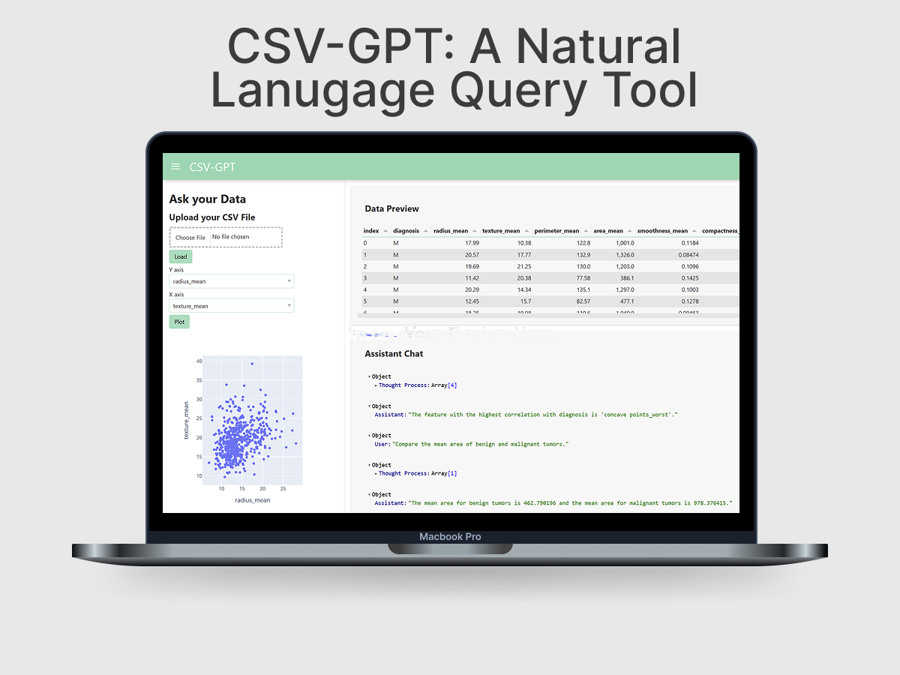

# 📊 CSV-GPT: A Natural Language Query Tool

<p align="center">
  
</p> 

A web application to query and analyze your CSV files using natural language with the power of **LangChain**, **OpenAI**, and **Panel**. This project enables users to upload any CSV file and interact with the data through natural language prompts, while also providing visual insights with Plotly charts and an interactive table.

---

## 🚀 Features

- **Upload any CSV** and instantly explore it
- **Ask questions** via a conversational interface
- **Interactive Plotly charts** to visualize any two features
- **Live data table** with sorting and filtering

---

## 📂 Setup Instructions

```bash
# 1. Clone the repository
git clone https://github.com/yourusername/natural-language-csv-analyzer.git
cd natural-language-csv-analyzer

# 2. Create a virtual environment (optional but recommended)
python -m venv .env
source .env/bin/activate  # On Windows use `.env\Scripts\activate`

# 3. Install the required libraries
pip install -r requirements.txt 
``` 

Create a `.env` file in the root directory and add your OpenAI API key like this: 

```bash 
# .env
OPENAI_API_KEY="your_openai_api_key_here" 
``` 

### 🧰 Technologies Used


### 🧠 Skills Applied


